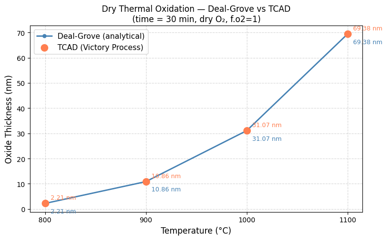
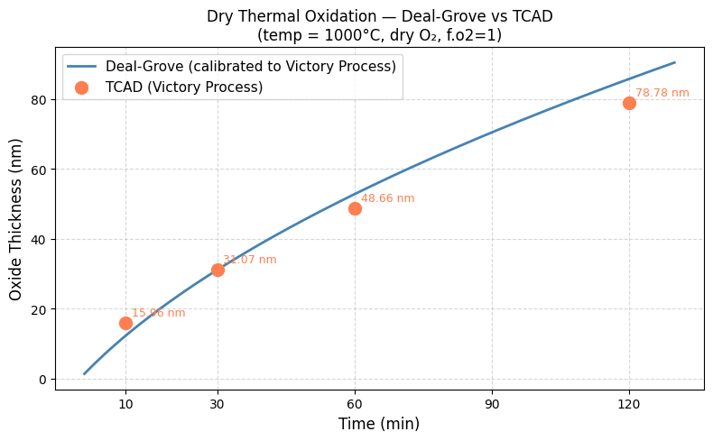
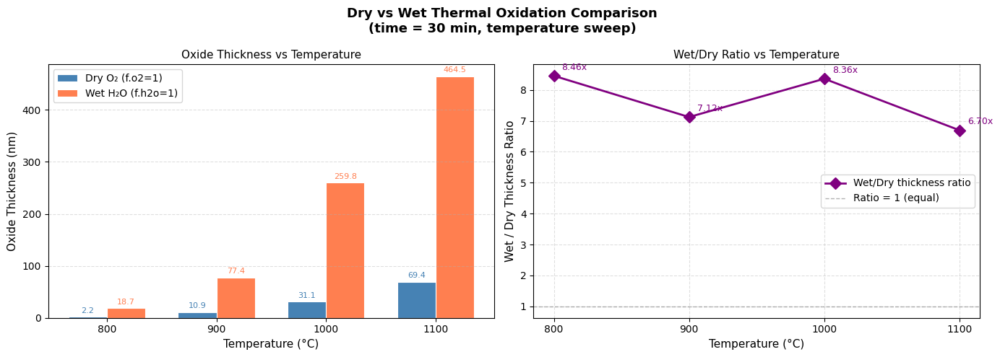

# tcad-oxidation-study
Parametric study of dry and wet thermal oxidation using Silvaco Victory Process TCAD

# Parametric Study of Thermal Oxidation
## Silvaco Victory Process TCAD

Based on Prof. S. Iyer's NPTEL Course on IC Fabrication

---

## Overview

This repository contains TCAD simulation scripts, Python analysis
code and results for a parametric study of dry and wet thermal
oxidation of silicon using Silvaco Victory Process on NanoHub.

## Studies

### 1. Temperature Sweep (Dry Oxidation)
- Temperature range: 800°C to 1100°C
- Fixed time: 30 min, dry O₂ (f.o2=1)
- Back-calculated Deal-Grove rate constants using inverse modelling
- Identified linear-to-parabolic transition at t* = 16.15 min (1000°C)

### 2. Time Sweep (Dry Oxidation)
- Time range: 10 to 120 min
- Fixed temperature: 1000°C, dry O₂
- Confirmed parabolic growth behaviour
- 30% deviation at 10 min explained by linear regime kinetics

### 3. Wet vs Dry Oxidation Comparison
- Temperature range: 800°C to 1100°C
- Fixed time: 30 min
- Wet oxidation grows 7-8x more oxide than dry at same conditions
- B constant ratio directly explains thickness ratio

## Tools

- Silvaco Victory Process TCAD (NanoHub, DeckBuild 5.2.31.C)
- Python — NumPy, Matplotlib (Google Colab)
- Reference: Deal & Grove, JAP Vol.36, No.12, 1965

## Results

### Temperature Sweep Results

| Temp (°C) | TCAD (nm) | Deal-Grove (nm) | Error % |
|---|---|---|---|
| 800 | 2.21 | 2.21 | 0.0 |
| 900 | 10.86 | 10.86 | 0.0 |
| 1000 | 31.07 | 31.07 | 0.0 |
| 1100 | 69.38 | 69.38 | 0.0 |

### Time Sweep Results

| Time (min) | TCAD (nm) | Deal-Grove (nm) | Error % |
|---|---|---|---|
| 10 | 15.96| 12.26 | 30.16 |
| 30 | 31.07 | 31.07 | 0.0 |
| 60 | 48.66 | 52.72 | 7.69 |
| 120 | 78.78 | 85.66 | 8.03 |

### Wet vs Dry Comparison

| Temp (°C) | Dry (nm) | Wet (nm) | Ratio |
|---|---|---|---|
| 800 | 2.21 | 18.69 | 8.5x |
| 900 | 10.86 | 77.36 | 7.1x |
| 1000 | 31.07 | 259.80 | 8.4x |
| 1100 | 69.38 | 464.53 | 6.7x |

## Key Findings

- Silvaco Victory Process uses internally calibrated Deal-Grove
  constants 4-6x smaller than original 1965 paper values
- Linear-to-parabolic transition at t* = A²/4B = 16.15 min at 1000°C
- Wet/dry thickness ratio of 7-8x explained by H₂O diffusivity
  advantage through SiO₂ network
- Wet 800°C grows more oxide than dry 1100°C beyond ~40 min

## ​Conclusion
​This study successfully established a robust simulation framework for the thermal oxidation of silicon using Silvaco TCAD. By systematically varying temperature and ambient conditions, the project provided a quantitative look at the kinetics governing oxide growth, bridging the gap between theoretical semiconductor physics and practical process engineering.
